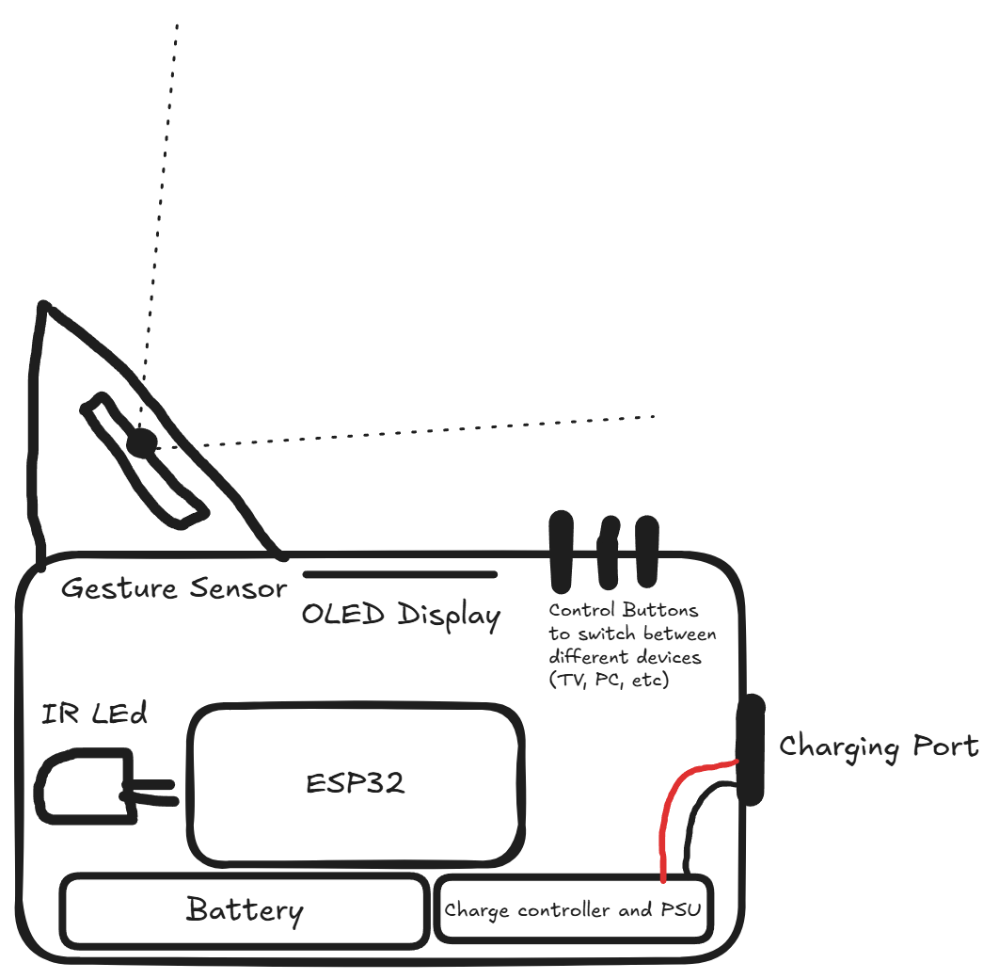
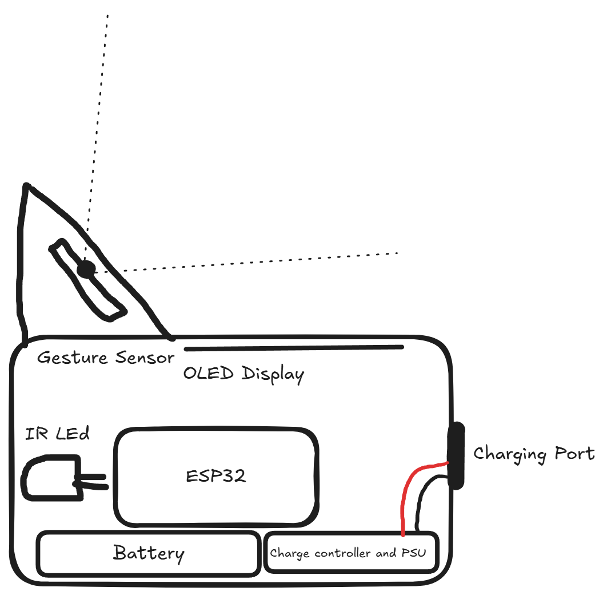
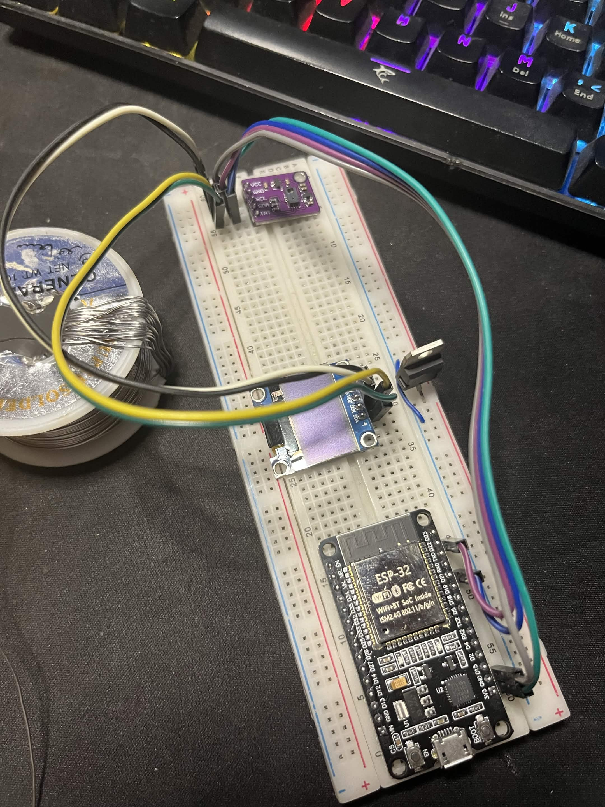
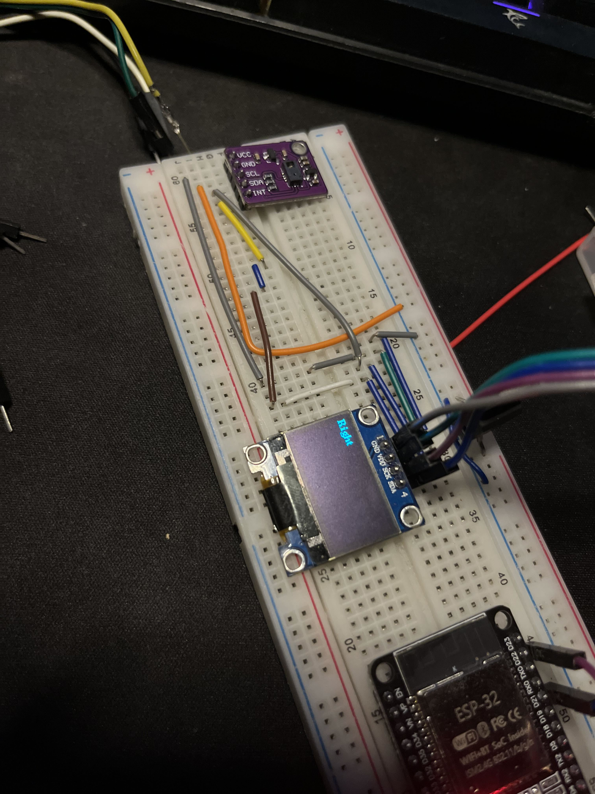
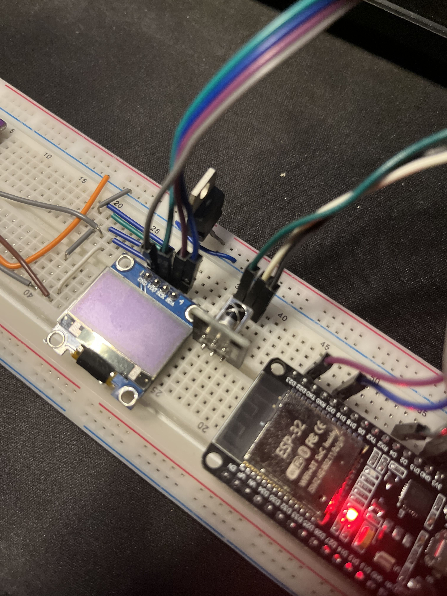
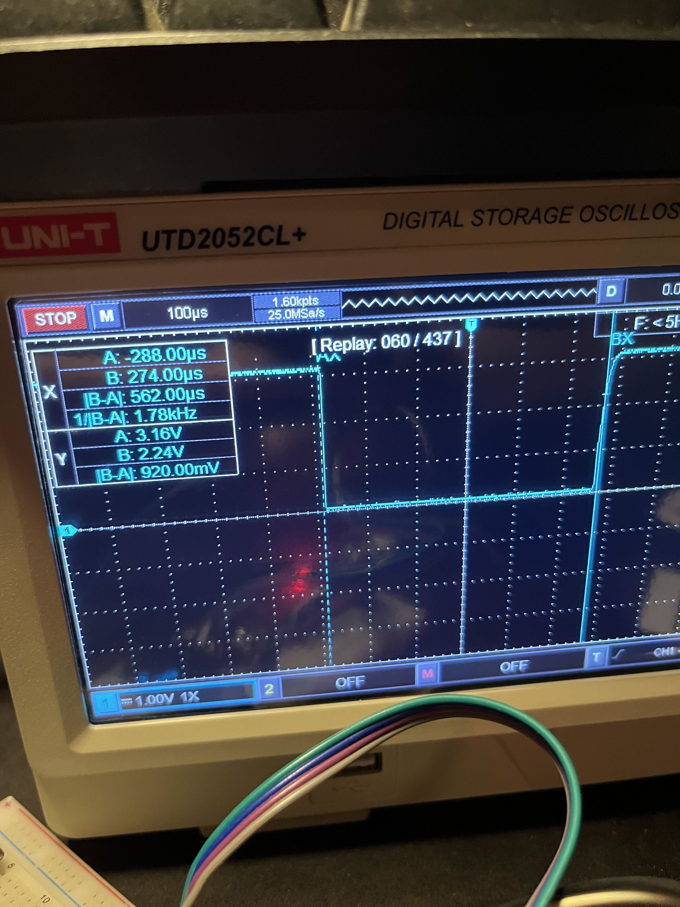

### Total time spent: -- Hours

## Entry 1 - Getting started! - July 12th - 1.15 Hours

### Sketching out the design

At first I thought about making the device so it has a gesture sensor for media controls, and buttons for switching profiles (TV, PC, etc.).

Here's how I intended the design to look like:

But then I thought there's no need for the buttons, as I can use one of the gestures supported by the sensor to switch between TV/PC (using the Move Forward / Move Backward gestures). So I removed them and changed the design to not have them:

Lapse recordings:  
[Media controller: Basic layout
](https://lapse.hackclub.com/timelapse/S1fzYW-wXMCX) 
[Finishing the 1st journal for media controller](https://lapse.hackclub.com/timelapse/r31FpIBMZaq-) 
***

## Entry 2 - Making a demo - August 8th - 2.05 Hours

### Putting the stuff on a breadboard

I Soldered some header pins to the gesture sensor and then I put everything on a breadboard.
I have the ESP32, the OLED display (which it's driver is a SSD1306) and the gesture sensor (A PAJ7620). 
 

### Making a demo code

I ran a demo code for the sensor and everything worked great except one thing, the forward/backward gestures. 

After doing the forward gesture, you will have to pull your hand away, which triggers a false backward gesture.
Same thing with the backward gesture, you need to put your hand in front of the sensor then move away. Putting your hand in front of the sensor triggers a wrong gesture (wether be it a left, right, up, or down gesture). 

So I decided to disable the backward gesture and add a delay after the forward sensor so the user has time to pull away. 

After that, I ran some graphic tests from the U8g2 library to test the display. It worked great and I modified my code so it shows what gesture was recognized.

Then I added a rep counter so it shows how many times did you repeat the gesture. 

But after adding that, the ESP32 stopped recognizing gestures. So I decided to upload the original test code without my modifications to see if it will work or not, and it did work!  

Then I realized that the problem was with the rep counting function. Instead of changing the variable storing the last gesture, I was changing the variable storing the current gesture, which made it look like there is no gestures. I fixed it and it worked great!
 

Then I researched how to chain clockwise/counter-clockwise gestures. I gotta admit I used AI on this one, but I didn't fully rely on it.  
I spent some time fine tunning and testing the angles and gestures debouncing and it's working great! 

** a pic of the project with the screen displaying stuff **

### What I'm doing next

Here's what I will be doing next: 
- get the ir sender and receiver ready
- make a test code that reads ir signals
- make a test code that sends hard coded ir signals
- make a test code that sends user coded ir signal (using an ir receiver)
- Make a code that pairs to a pc and controls media over bluetooth
- merge both functions together and let the user decided which function to use
- Make cool graphics for the display

 

Lapse recordings:  
[Making a code to interpret gestures](https://lapse.hackclub.com/timelapse/9EifI0f1eVn_)
 ***

## Entry 3 - Messing around with IR - August 8th - 0.9 Hours

### Getting the Breadboard ready

I put the IR receiver (TL1838 VS1838B) on the breadboard so I can mess around with it and figure out how the IR protocol works.

### Figuring out which protocol my TV uses

Using an oscilloscope, I discovered that my remote operates on NEC protocol which has a 1T of 562 µs.

So I had claude make a code that reads IR signals and shows them to me on the serial monitor. 

It was getting late so  I decided that's enough for today.

### What I'm doing next

Here's what I will be doing next: 
- make a test code that sends hard coded ir signals
- make a test code that sends user coded ir signal (using an ir receiver)
- Make a code that pairs to a pc and controls media over bluetooth
- merge both functions together and let the user decided which function to use
- Make cool graphics for the display

 

Lapse recordings:  
[Testing IR receiver](https://lapse.hackclub.com/timelapse/zANNEGai21DX)
***

## Entry 4 - Sending signals with IR - August 9th - 1.3 Hours

### Getting an IR sender LED

I didn't have an IR LED so I decided to salvage one from my RGB LEDs controller.

** image of controller stripped apart **

### Making a test code for the IR led

I made a code for the IR LED to send hardcoded signals when some gestures are recognized but it didn't work. I accidentally burned the IR LED so I had to get another remote so I can salvage another LED and not burn it this time.

The code worked and the TV recognized the signals!

I spent some time trying to figure out how to store the IR data into the ESP32 non volatile storage. But I think I have done Enough for today.
 

Lapse recordings:  
[Getting the IR working](https://lapse.hackclub.com/timelapse/jJdBno_JCZZk)
***

## Entry 5 - Storing IR signals dynamically - August 10th - 2.2 Hours

Nothing much to say.
I made a code that utilizes the ESP32 NVS and stores the signals. 
I have also added a button that deletes the stored data (in case the user is having a new TV or anything similar). 

I was planning to make this device work with both TV and PC and I was going to make a better UI for it but I won't be able to do so as I'm extremely short on time. I'm satisfied with how it works for the moment. 

What's left is to make the schematic and the PCB for the device, then the enclosure.
 

Lapse recordings:  
[Storing IR signals dynamically](https://lapse.hackclub.com/timelapse/v13pgNrjCIoe)
***